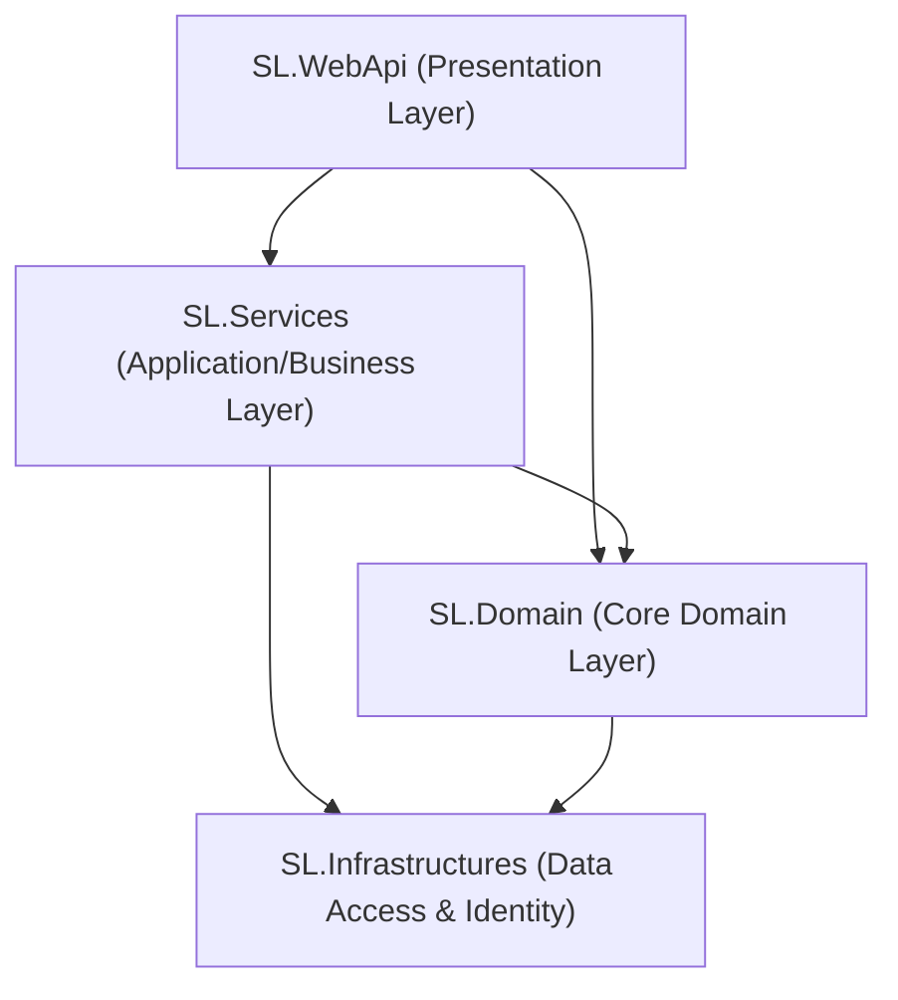
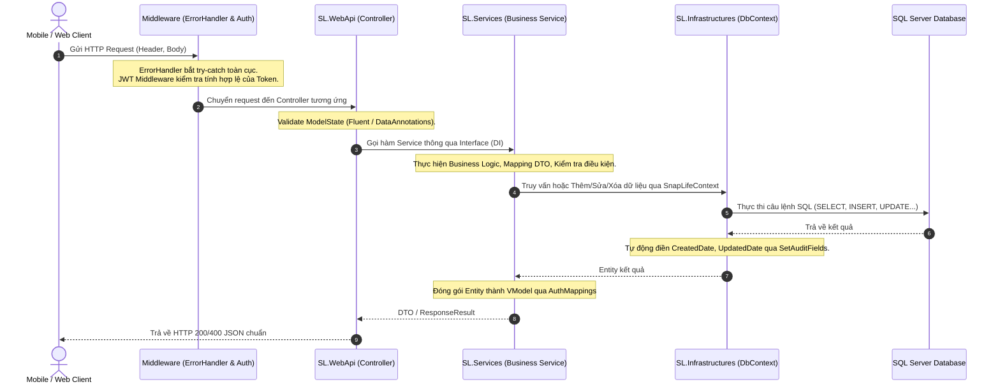

# 📸 HƯỚNG DẪN KIẾN TRÚC & DỰ ÁN SNAPLIFE BACKEND

Dự án **SnapLife** là nền tảng Backend API phục vụ mạng xã hội chia sẻ hình ảnh, khoảnh khắc đời thường (Snaps / Stories), tương tác và kết nối cộng đồng. Dự án được kiến trúc theo mô hình **Onion Architecture** (Kiến trúc củ hành) trên nền tảng **.NET 8.0**, kế thừa các chuẩn thiết kế thực tế từ dự án `coffee-shop-backend`.

---

## 1. Tổng quan Kiến trúc Onion Architecture

Mô hình Onion Architecture cô lập nghiệp vụ cốt lõi ở tầng trung tâm, các tầng bên ngoài phụ thuộc vào tầng bên trong (Dependency Inversion Principle).



### Chi tiết vai trò 4 tầng:

| Layer | Vai trò chính | Thư viện sử dụng |
| :--- | :--- | :--- |
| **`SL.Domain`** | **Core trung tâm**: Chứa các Models chung (`BaseModel`, `ResponseResult`, `PaginationModel`), Constants, Enums, DTO/ViewModels (`AuthVModel`), Configurations (`AppSetting`), và các Interfaces (`IAuthService`, `IPostService`...). Tầng này không phụ thuộc vào tầng Service hay WebApi. | `Swashbuckle`, `Microsoft.IdentityModel.Tokens` |
| **`SL.Infrastructures`** | **Data Access & Identity**: Chứa `DbContext` (`SnapLifeContext`), các Thực thể CSDL (`AspNetUsers`, `AspNetRoles`, `Post`, `Story`, `Comment`, `Reaction`...), cấu hình Fluent API, Audit Entity (`CreatedDate`, `IsActive`...). | `EF Core`, `EF Core SqlServer`, `Identity.EntityFrameworkCore` |
| **`SL.Services`** | **Business Logic Layer**: Triển khai logic nghiệp vụ (`AuthService`, `PostService`...), chuyển đổi dữ liệu (Mapping / AutoMapper), xử lý JWT Token (`GenerateToken`), gửi mail, upload file. | `AutoMapper`, `System.IdentityModel.Tokens.Jwt` |
| **`SL.WebApi`** | **Presentation Layer**: Điểm tiếp nhận request từ Client (Mobile App, Web App), chứa API Controllers, Middleware xử lý ngoại lệ (`ErrorHandlerMiddleware`), cấu hình CORS, JWT Authentication, Swagger, Dependency Injection trong `Program.cs`. | `AspNetCore.Authentication.JwtBearer`, `EF Core Tools`, `Swagger` |

---

## 2. Cấu trúc thư mục dự án SnapLife

```
SnapLife/
│
├── SnapLife.sln                                     # Visual Studio Solution chứa 4 projects
│
├── SL.Domain/                                       # Tầng Domain (Models & Contracts)
│   ├── Common/
│   │   ├── Constants/                               # Hằng số hệ thống (Strings, Numbers, Enums, Globals)
│   │   ├── Dummy/                                   # Dữ liệu mẫu (DummyData)
│   │   ├── Models/                                  # Base Response, BaseModel, PaginationModel, AppException
│   │   └── Ultilities/                              # Convert JSON, JsonHelper, DateOnlyJsonConverter
│   ├── Configurations/                              # Đọc cấu hình từ appsettings (JwtIssuerOptions, AppSetting)
│   ├── Constants/                                   # CommonConstants (Format ngày giờ...)
│   ├── IServices/                                   # Chứa toàn bộ Interfaces dịch vụ
│   │   └── ISysServices/
│   │       └── IAuthService.cs                      # Interface Đăng ký, Đăng nhập, Me
│   └── VModels/                                     # DTOs / ViewModels nhận và trả về từ API
│       └── SysVModels/
│           └── AuthVModel.cs                        # LoginVModel, RegisterVModel, LoginResponse, MeVModel...
│
├── SL.Infrastructures/                              # Tầng CSDL & Entities
│   ├── EntityFramework/
│   │   ├── SnapLifeContext.cs                       # DbContext quản lý toàn bộ bảng, khóa ngoại, index, audit
│   │   └── Entities/
│   │       ├── SysEntities/                         # Các bảng cơ sở và hệ thống
│   │       │   ├── AuditEntity.cs                   # Base audit: CreatedDate, CreatedBy, UpdatedDate, IsActive
│   │       │   ├── BaseEntity.cs                    # AuditEntity + Id (long)
│   │       │   ├── AspNetUsers.cs                   # Kế thừa IdentityUser (Profile, Bio, Counters...)
│   │       │   ├── AspNetRoles.cs                   # Kế thừa IdentityRole
│   │       │   ├── SysFile.cs                       # Quản lý file media (Ảnh, video, kích thước, duration)
│   │       │   ├── SysActivityLog.cs                # Audit log lịch sử thao tác hệ thống
│   │       │   └── SysConfiguration.cs              # Cấu hình Key-Value động
│   │       ├── PrivacyLevel.cs                      # Enum: Public, Friends, Private
│   │       ├── Post.cs                              # Bài viết chính
│   │       ├── PostMedia.cs                         # Danh sách ảnh/video gắn trong bài viết
│   │       ├── Story.cs                             # Khoảnh khắc (Snap) 24h
│   │       ├── StoryView.cs                         # Người đã xem story
│   │       ├── Hashtag.cs & PostHashtag.cs          # Quản lý xu hướng hashtag N-N
│   │       ├── Comment.cs                           # Bình luận đa cấp (hỗ trợ reply đệ quy)
│   │       ├── ReactionType.cs & Reaction.cs        # Thả cảm xúc (Like, Love, Haha, Wow...)
│   │       ├── RelationshipType.cs & Status.cs      # Enum quan hệ
│   │       ├── UserRelationship.cs                  # Theo dõi (Follow), Kết bạn, Chặn (Block)
│   │       ├── Bookmark.cs                          # Lưu bài viết vào bộ sưu tập
│   │       ├── NotificationType.cs & Notification.cs# Thông báo tương tác in-app
│   │       ├── UserRefreshToken.cs                  # Refresh Token cấp lại phiên
│   │       └── UserDevice.cs                        # Quản lý Device Token (FCM Push Notification)
│   └── SqlConnectionString/
│       └── BaseConnectionToMssql.cs
│
├── SL.Services/                                     # Tầng Logic nghiệp vụ
│   ├── Helpers/
│   │   └── GenerateToken.cs                         # Helper sinh Bearer JWT Token kèm Claims
│   ├── Mappings/
│   │   └── AuthMappings.cs                          # Ánh xạ Entity <-> DTO
│   └── Services/
│       └── SysServices/
│           └── AuthService.cs                       # Triển khai Login, Register, Me
│
└── SL.WebApi/                                       # Tầng API Endpoints & Cấu hình máy chủ
    ├── Controllers/
    │   └── SysControllers/
    │       └── AuthController.cs                    # Các route /api/Auth/Register, Login, Me
    ├── Middleware/
    │   └── ErrorHandlerMiddleware.cs                # Bắt lỗi toàn cục, trả về ResponseResult chuẩn JSON
    ├── Properties/
    │   └── launchSettings.json                      # Cấu hình cổng chạy dev (http: 5000, https: 5001)
    ├── Program.cs                                   # Điểm chạy khởi tạo: DI, DbContext, Identity, JWT, Swagger
    ├── appsettings.json                             # Chuỗi kết nối DB, JWT Secret Key, Cấu hình Upload...
    └── appsettings.Development.json
```

---

## 3. Luồng xử lý chi tiết (Request-Response Lifecycle Flow)

Dưới đây là sơ đồ chu trình khi một request từ người dùng (ví dụ: **Đăng nhập** hoặc **Đăng bài viết**) được gửi tới hệ thống:



---

## 4. Chuẩn hóa Cơ chế Phân trang & Lọc Dữ liệu (Pagination & Filtering Standards)

SnapLife kế thừa và chuẩn hóa cơ chế phân trang từ dự án mẫu `coffee-shop-backend` với các tối ưu vượt trội:

```
                  Client Request [FromQuery] (e.g. PageNumber=1, PageSize=20, SearchString)
                                            │
                                            ▼
                             ┌──────────────────────────────┐
                             │  BaseFilterParams (SL.Domain)│
                             │  - PageNumber = 1            │
                             │  - PageSize = 20 (Mobile)    │
                             │  - SearchString / Keyword    │
                             │  - IsActive = true           │
                             └──────────────┬───────────────┘
                                            │ Kế thừa
                                            ▼
                             ┌──────────────────────────────┐
                             │  PostFilterParams / Expense  │
                             │  - IsExpenseOnly, GroupId    │
                             │  - FromDate, ToDate          │
                             │  - MinAmount, MaxAmount      │
                             └──────────────┬───────────────┘
                                            │
                                            ▼
                       Expression<Func<T, bool>> BuildQueryable(...)
                                            │
                    ┌───────────────────────┴───────────────────────┐
                    ▼                                               ▼
         await query.CountAsync()                  await query.Skip().Take().ToListAsync()
        (Đếm nhanh trước khi Join)                   (Phân trang & Mapping DTO chuẩn)
                    │                                               │
                    └───────────────────────┬───────────────────────┘
                                            ▼
                             ┌──────────────────────────────┐
                             │  PaginationModel<T>          │
                             │  - TotalRecords: long        │
                             │  - Records: IEnumerable<T>   │
                             └──────────────────────────────┘
```

### Các nguyên tắc bắt buộc:
1. **Lớp tham số cha `BaseFilterParams`**: Mọi DTO lọc phân trang (`PostFilterVModel`, `ExpenseFilterParams`, `UserSearchFilterVModel`) đều phải kế thừa `BaseFilterParams` để thống nhất `PageNumber`, `PageSize = 20` (chuẩn mobile), `SearchString` và `IsActive`.
2. **Tách biệt điều kiện lọc bằng Expression Tree (`BuildQueryable`)**: Service phải tách riêng hàm `BuildQueryable(fParams)` trả về `Expression<Func<T, bool>>` để đóng gói toàn bộ logic lọc (`WHERE`), giúp code dễ đọc và dễ test.
3. **Hiệu năng đếm (`CountAsync`)**: Luôn sử dụng `await query.CountAsync()` bất đồng bộ trước khi thực hiện các lệnh `.Include()` / `.ThenInclude()` nặng nề để giảm tải tối đa cho SQL Server.

---

## 5. Kế hoạch trước khi Triển khai (Pre-deployment Checklist)

Trước khi đưa tính năng hoặc toàn bộ dự án lên môi trường Staging / Production, cần hoàn thành các bước sau:

### 1. Chuẩn bị Cơ sở Dữ liệu & Kết nối
- [ ] Cập nhật chuỗi kết nối `SnapLifeDatabase` trong `appsettings.json` trỏ tới SQL Server đích.
- [ ] Tạo Migration ban đầu bằng EF Core Tools:
  ```powershell
  dotnet ef migrations add InitialSnapLifeDatabase --project SL.Infrastructures --startup-project SL.WebApi
  dotnet ef database update --project SL.Infrastructures --startup-project SL.WebApi
  ```
- [ ] Kiểm tra Seed Data ban đầu: Tạo sẵn các Role mặc định (`Administrator`, `Moderator`, `Member`) trong CSDL.

### 2. Bảo mật & An toàn thông tin
- [ ] Đổi `Jwt:Key` ngẫu nhiên có độ dài tối thiểu 256-bit (không dùng key mặc định ở môi trường dev).
- [ ] Cấu hình CORS chặt chẽ: Chỉ cho phép các domain Web Client / Mobile App được gọi API.
- [ ] Bật `UseHttpsRedirection()` và cấu hình chứng chỉ SSL.

### 3. Tối ưu hóa hiệu năng
- [ ] Cấu hình nén phản hồi (Response Compression).
- [ ] Sử dụng MemoryCache cho các dữ liệu ít biến động (Cấu hình hệ thống, Danh mục).
- [ ] Đảm bảo các bảng dữ liệu lớn (`Posts`, `Comments`, `Reactions`) đã có đầy đủ Index.

---

## 5. Quy trình Kiểm thử (Testing Strategy)

Hệ thống được kiểm thử theo 3 cấp độ:

```
        ┌───────────────────────────┐
        │   3. End-to-End (E2E)     │  <-- Kiểm thử qua Swagger UI / Postman Flows
        ├───────────────────────────┤
        │   2. Integration Tests    │  <-- Test API Controller + In-Memory DbContext
        ├───────────────────────────┤
        │   1. Unit Tests           │  <-- Test độc lập Logic Service, Helper, Mapping
        └───────────────────────────┘
```

### 1. Unit Testing
- **Thư mục dự án đề xuất**: `SL.Tests/UnitTests/`
- **Thư viện**: `xUnit`, `Moq`, `FluentAssertions`
- **Phạm vi test**:
  - `GenerateTokenTests`: Xác thực token sinh ra có chứa đúng Claims (`UserId`, `Email`, `Roles`) và đúng thời gian hết hạn.
  - `AuthServiceTests`: Mock `UserManager` để test các ca: Đăng ký thành công, Đăng ký trùng email, Đăng nhập sai mật khẩu, Đăng nhập khi tài khoản bị khóa (`IsActive = false`).

### 2. Integration Testing
- **Mục tiêu**: Kiểm tra sự phối hợp giữa Controller ➡️ Service ➡️ DbContext.
- **Cách thức**: Sử dụng `Microsoft.AspNetCore.Mvc.Testing` kết hợp `Microsoft.EntityFrameworkCore.InMemory` hoặc Docker SQL Server test container.
- **Kịch bản test**:
  - Test luồng: Đăng ký user mới ➡️ Đăng nhập lấy Token ➡️ Gọi API `/api/auth/me` với Token vừa nhận được và xác minh mã trạng thái HTTP 200.

### 3. Kiểm thử thủ công qua Swagger & Postman (Manual & API Testing)
1. Khởi chạy ứng dụng:
   ```powershell
   dotnet run --project d:\Github\SnapLife\SL.WebApi
   ```
2. Mở trình duyệt truy cập: `https://localhost:5001/swagger/index.html`
3. Thực hiện chuỗi hành động:
   - **Step 1**: Gọi `POST /api/Auth/Register` với dữ liệu hợp lệ ➡️ Nhận kết quả thành công.
   - **Step 2**: Gọi `POST /api/Auth/Login` ➡️ Copy chuỗi `token`.
   - **Step 3**: Nhấn nút **Authorize** trên Swagger UI, nhập `Bearer <token>` ➡️ Nhấn Authorize.
   - **Step 4**: Gọi `GET /api/Auth/Me` ➡️ Kiểm tra response trả về đúng thông tin tài khoản vừa đăng nhập.

